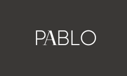

<!--
*** Thanks for checking out the Best-README-Template. If you have a suggestion
*** that would make this better, please fork the repo and create a pull request
*** or simply open an issue with the tag "enhancement".
*** Don't forget to give the project a star!
*** Thanks again! Now go create something AMAZING! :D
-->

[![LinkedIn][linkedin-shield]][linkedin-url]

<!-- PROJECT LOGO -->
 

  

<h3 align="center">PABLO Shopping App</h3>

  

Pablo Is an app designed for D2C online Retailers that offers, high-quality clothing, accessories and beauty products for men and women. Front-End Multi-page Project with Landing/Products/ and Product page with Carousel, Cart, and Filter Functionality. Built with React, SASS, and JavaScript 
     
    <a href="https://github.com/PPableo/shopping-app-paulPableoProject2"><strong>Explore the docs »</strong></a>
     
     
    <a href="https://pabloproject2.netlify.app/">View Demo</a>
    ·
    <a href="https://github.com/PPableo/shopping-app-paulPableoProject2/issues">Report Bug</a>
    ·
    <a href="https://github.com/PPableo/shopping-app-paulPableoProject2/issues">Request Feature</a>
  

<!-- TABLE OF CONTENTS -->

  
Table of Contents

  <ol>
    <li>
      <a href="#about-the-project">About The Project</a>
      <ul>
        <li><a href="#built-with">Built With</a></li>
      </ul>
    </li>
    <li><a href="#usage">Usage</a></li>
    <li><a href="#roadmap">Roadmap</a></li>
    <li><a href="#contact">Contact</a></li>
    <li><a href="#acknowledgments">Acknowledgments</a></li>
  </ol>

<!-- ABOUT THE PROJECT -->
## About The Project

[![Product Name Screen Shot][product-screenshot]](https://pabloproject2.netlify.app/)

### Built With

* [![HTML5][HTML5.js]][HTML-url]
* [![SASS][SASS.js]][SASS-url]
* [![React][React.js]][React-url]

(<a href="#readme-top">back to top</a>)

<!-- USAGE EXAMPLES -->
## Usage

📌Pablo is a ecommerce platform designed as a direct-to-consumer online retailer. Pablo offers a wide range of high-quality clothing, accessories, and beauty products for men and women. With a sleek and user-friendly design, Pablo makes shopping easy and enjoyable.

👉Our landing page features a beautiful carousel displaying our latest products, while our product page allows customers to easily browse and filter through our extensive selection. The cart functionality makes it simple to add items to your purchase and keep track of your order.

👉Built with React, SASS, and JavaScript, Pablo offers lightning-fast performance and a seamless user experience. Whether you're looking for the latest fashion trends or searching for the perfect gift, Pablo has you covered. Try it out today and experience the future of online shopping.

_For more examples, please refer to the [Documentation](https://example.com)_

(<a href="#readme-top">back to top</a>)

<!-- ROADMAP -->
## Roadmap

- [ ] MediaQueries
- [ ] Stripe Payments
- [ ] Backend
    - [ ] CMS

See the [open issues](https://github.com/PPableo/shopping-app-paulPableoProject2/issues) for a full list of proposed features (and known issues).

(<a href="#readme-top">back to top</a>)

<!-- CONTACT -->
## Contact

https://paulpableo.com/

Project Link: [https://github.com/PPableo/shopping-app-paulPableoProject2](https://github.com/PPableo/shopping-app-paulPableoProject2)

(<a href="#readme-top">back to top</a>)

<!-- ACKNOWLEDGMENTS -->
## Acknowledgments

* [PEXELS @mitch-lally-401527143](https://www.pexels.com/@mitch-lally-401527143/)
* [MUI ICONS](https://mui.com/material-ui/material-icons/)
* [Lama Dev](https://www.youtube.com/watch?v=BCkWFblNLKU&t=207s)

(<a href="#readme-top">back to top</a>)

<!-- MARKDOWN LINKS & IMAGES -->
<!-- https://www.markdownguide.org/basic-syntax/#reference-style-links -->
[contributors-shield]: https://img.shields.io/github/contributors/github_username/shopping-app-paulPableoProject2.svg?style=for-the-badge
[contributors-url]: https://github.com/PPableo/shopping-app-paulPableoProject2/graphs/contributors
[issues-shield]: https://img.shields.io/github/issues/PPableo/shopping-app-paulPableoProject2.svg?style=for-the-badge
[issues-url]: https://github.com/PPableo/shopping-app-paulPableoProject2/issues
[linkedin-shield]: https://img.shields.io/badge/-LinkedIn-black.svg?style=for-the-badge&logo=linkedin&colorB=555
[linkedin-url]: https://linkedin.com/in/paulpableo
[product-screenshot]: images/screenshot.png
[HTML5.js]: https://img.shields.io/badge/HTML-E34F26?style=for-the-badge&logo=html5&logoColor=white
[HTML-url]: https://developer.mozilla.org/en-US/docs/Glossary/HTML5/
[React.js]: https://img.shields.io/badge/React-20232A?style=for-the-badge&logo=react&logoColor=61DAFB
[React-url]: https://reactjs.org/
[SASS.js]: https://img.shields.io/badge/SASS-CC6699?style=for-the-badge&logo=SASS&logoColor=white
[SASS-url]: https://sass-lang.com/
